# 🚀 Jenkins Demo - Pipeline CI/CD Java

[](http://localhost:8080/job/Java-CI-Pipeline/)
[](https://openjdk.java.net/projects/jdk/21/)
[](https://maven.apache.org/)
[](https://junit.org/junit4/)
[](LICENSE)

> **Projet académique** de démonstration d'un pipeline d'intégration continue (CI/CD) utilisant Jenkins, Maven et JUnit dans le cadre du TP3 DevOps - Méthodes de développement (GI20).

## 📋 Table des matières

- [🎯 Objectif du projet](#-objectif-du-projet)
- [🏗️ Architecture](#️-architecture)
- [⚙️ Prérequis](#️-prérequis)
- [🚀 Installation locale](#-installation-locale)
- [🔧 Configuration Jenkins](#-configuration-jenkins)
- [📊 Métriques du projet](#-métriques-du-projet)
- [🧪 Tests](#-tests)
- [📁 Structure du projet](#-structure-du-projet)
- [🔄 Pipeline CI/CD](#-pipeline-cicd)
- [📈 Résultats](#-résultats)
- [🎓 Compétences développées](#-compétences-développées)
- [📝 Documentation](#-documentation)
- [🤝 Contribution](#-contribution)
- [📞 Contact](#-contact)

## 🎯 Objectif du projet

Ce projet démontre l'implémentation d'un **pipeline d'intégration continue** complet pour une application Java, automatisant les processus de build, test et déploiement.

### Fonctionnalités clés :
- ✅ **Intégration continue** avec Jenkins
- ✅ **Build automatique** via Maven
- ✅ **Tests unitaires** avec JUnit (100% de couverture)
- ✅ **Déclenchement automatique** sur commit Git
- ✅ **Rapports de qualité** en temps réel
- ✅ **Monitoring** et historique des builds

## 🏗️ Architecture

```
┌─────────────┐    ┌─────────────┐    ┌─────────────┐    ┌─────────────┐
│   GitHub    │───▶│   Jenkins   │───▶│    Maven    │───▶│    JUnit    │
│ Repository  │    │   Server    │    │    Build    │    │   Testing   │
└─────────────┘    └─────────────┘    └─────────────┘    └─────────────┘
       │                   │                   │                   │
       │                   ▼                   ▼                   ▼
       │            ┌─────────────┐    ┌─────────────┐    ┌─────────────┐
       └───────────▶│ Poll SCM    │    │  Artifacts  │    │   Reports   │
                    │ (2 minutes) │    │   (.jar)    │    │   (XML)     │
                    └─────────────┘    └─────────────┘    └─────────────┘
```

## ⚙️ Prérequis

### Environnement de développement :
- **OS** : Linux (Kali Linux recommandé)
- **Java** : OpenJDK 21+
- **Maven** : 3.9.6+
- **Git** : 2.47+
- **Jenkins** : 2.504.1+

### Installation des prérequis :
```bash
# Mise à jour du système
sudo apt update && sudo apt upgrade -y

# Installation Java 21
sudo apt install openjdk-21-jdk -y

# Installation Maven et Git
sudo apt install maven git -y

# Vérification des versions
java -version
mvn -version
git --version
```

## 🚀 Installation locale

### 1. Cloner le dépôt
```bash
git clone https://github.com/OUSSAMA-AH/jenkins-demo.git
cd jenkins-demo
```

### 2. Compilation et tests locaux
```bash
# Compilation complète avec tests
mvn clean install

# Exécution des tests uniquement
mvn test

# Compilation sans tests
mvn clean compile
```

### 3. Exécution de l'application
```bash
# Compiler le JAR
mvn clean package

# Exécuter (si point d'entrée défini)
java -jar target/jenkins-demo-1.0-SNAPSHOT.jar
```

## 🔧 Configuration Jenkins

### Installation Jenkins sur Kali Linux :
```bash
# Ajout de la clé GPG Jenkins
curl -fsSL https://pkg.jenkins.io/debian-stable/jenkins.io-2023.key | sudo tee /usr/share/keyrings/jenkins-keyring.asc > /dev/null

# Ajout du dépôt
echo deb [signed-by=/usr/share/keyrings/jenkins-keyring.asc] https://pkg.jenkins.io/debian-stable binary/ | sudo tee /etc/apt/sources.list.d/jenkins.list > /dev/null

# Installation
sudo apt update && sudo apt install jenkins -y

# Démarrage
sudo systemctl start jenkins
sudo systemctl enable jenkins
```

### Configuration du job Jenkins :
1. **Nouveau job** : `Java-CI-Pipeline` (Freestyle project)
2. **Source Code Management** : Git → `https://github.com/OUSSAMA-AH/jenkins-demo.git`
3. **Build Triggers** : Poll SCM → `H/2 * * * *`
4. **Build Steps** : Execute shell → `mvn clean install`
5. **Post-build Actions** : Publish JUnit test results → `target/surefire-reports/TEST-*.xml`

### Accès Jenkins :
- **URL** : http://localhost:8080
- **Mot de passe initial** : `sudo cat /var/lib/jenkins/secrets/initialAdminPassword`

## 📊 Métriques du projet

| Métrique | Valeur |
|----------|--------|
| **Builds totaux** | 7 |
| **Taux de succès** | 100% |
| **Temps moyen de build** | 45 secondes |
| **Tests exécutés** | 6 |
| **Couverture de tests** | 100% |
| **Lignes de code** | ~50 (source) + ~60 (tests) |

## 🧪 Tests

### Structure des tests JUnit :
```java
// Couverture complète de la classe Calculator
✅ testAdd()           - Addition de base
✅ testSubtract()      - Soustraction
✅ testMultiply()      - Multiplication  
✅ testDivide()        - Division normale
✅ testDivideByZero()  - Gestion des erreurs
✅ testPower()         - Opération puissance
```

### Exécution des tests :
```bash
# Tests unitaires
mvn test

# Tests avec rapport détaillé
mvn surefire-report:report

# Vérification coverage
mvn jacoco:report
```

## 📁 Structure du projet

```
jenkins-demo/
├── src/
│   ├── main/
│   │   └── java/
│   │       └── com/
│   │           └── example/
│   │               └── Calculator.java        # Classe principale
│   └── test/
│       └── java/
│           └── com/
│               └── example/
│                   └── CalculatorTest.java    # Tests JUnit
├── target/                                    # Répertoire de build Maven
│   ├── classes/                              # Classes compilées
│   ├── test-classes/                         # Tests compilés
│   ├── surefire-reports/                     # Rapports JUnit XML
│   └── jenkins-demo-1.0-SNAPSHOT.jar        # Artifact final
├── pom.xml                                   # Configuration Maven
└── README.md                                 # Ce fichier
```

## 🔄 Pipeline CI/CD

### Workflow automatique :

```mermaid
graph TD
    A[Développeur: git push] --> B[GitHub: Nouveau commit]
    B --> C[Jenkins: Poll SCM détecte changement]
    C --> D[Jenkins: Clone repository]
    D --> E[Maven: mvn clean install]
    E --> F[Maven: Compilation sources]
    F --> G[Maven: Exécution tests JUnit]
    G --> H[Jenkins: Publication rapports]
    H --> I[Notification: Build status]
    
    G -->|Tests échouent| J[Build FAILED]
    G -->|Tests réussissent| K[Build SUCCESS]
```


### Déclenchement :
- **Automatique** : Surveillance Git toutes les 2 minutes (Poll SCM)
- **Manuel** : Bouton "Build Now" dans Jenkins
- **Sur commit** : Chaque `git push` déclenche un build dans les 2 minutes

## 📈 Résultats

### Dashboard Jenkins :

- ✅ **7 builds consécutifs réussis**
- ✅ **0 échec de test** 
- ✅ **Pipeline stable et fiable**

### Rapports de qualité :
- **Code Coverage** : 100% des méthodes testées
- **Test Success Rate** : 100% (6/6 tests passent)
- **Build Time** : Stable autour de 45 secondes
- **Code Quality** : Respect des conventions Java

## 🎓 Compétences développées

### DevOps & CI/CD :
- ✅ **Jenkins** : Installation, configuration, administration
- ✅ **Pipeline CI/CD** : Conception et implémentation
- ✅ **Automatisation** : Build, test et déploiement automatiques
- ✅ **Monitoring** : Surveillance et observabilité

### Développement Java :
- ✅ **Maven** : Gestion de projet et dépendances
- ✅ **JUnit** : Tests unitaires et TDD
- ✅ **Git** : Contrôle de version et collaboration
- ✅ **Bonnes pratiques** : Code clean et documentation

## 📝 Documentation

### Ressources du projet :
- **[Rapport technique complet](docs/rapport_jenkins.pdf)** - Documentation LaTeX détaillée
- **[Guide d'installation](docs/installation.md)** - Instructions pas à pas
- **[Configuration Jenkins](docs/jenkins-config.md)** - Paramétrage détaillé
- **[Troubleshooting](docs/troubleshooting.md)** - Résolution de problèmes

### Références externes :
- [Documentation Jenkins](https://www.jenkins.io/doc/)
- [Maven Getting Started](https://maven.apache.org/guides/getting-started/)
- [JUnit 4 Documentation](https://junit.org/junit4/)

## 🤝 Contribution

Ce projet étant un TP académique, les contributions externes ne sont pas acceptées. Cependant, vous pouvez :

### Pour les étudiants :
1. **Fork** le projet pour vos propres expérimentations
2. **Adapter** la configuration à votre environnement
3. **Étendre** avec de nouvelles fonctionnalités (SonarQube, Docker, etc.)

### Suggestions d'amélioration :
- 🔄 Migration vers Jenkins Pipeline (Jenkinsfile)
- 🐳 Containerisation avec Docker
- ☁️ Déploiement cloud (AWS, Azure, GCP)
- 📊 Intégration SonarQube pour l'analyse de code
- 📧 Notifications Slack/Email
- 🔒 Gestion avancée des credentials

## 📞 Contact

### Auteur :
**AHAMRI Oussama**
- 🎓 **Formation** : Génie Informatique (GI20)
- 🏫 **Établissement** : Académie Internationale Mohammed VI de l'Aviation Civile
- 📧 **Email** : [oussama.ahamri@aimac.ma](mailto:oussama.ahamri@aimac.ma)
- 💼 **LinkedIn** : [linkedin.com/in/oussama-ahamri](https://linkedin.com/in/oussama-ahamri)

### Support technique :
- 🐛 **Issues** : [GitHub Issues](https://github.com/OUSSAMA-AH/jenkins-demo/issues)
- 📖 **Wiki** : [GitHub Wiki](https://github.com/OUSSAMA-AH/jenkins-demo/wiki)
- 💬 **Discussions** : [GitHub Discussions](https://github.com/OUSSAMA-AH/jenkins-demo/discussions)

---

## 📜 Licence

```
MIT License

Copyright (c) 2025 AHAMRI Oussama

Permission is hereby granted, free of charge, to any person obtaining a copy
of this software and associated documentation files (the "Software"), to deal
in the Software without restriction, including without limitation the rights
to use, copy, modify, merge, publish, distribute, sublicense, and/or sell
copies of the Software, and to permit persons to whom the Software is
furnished to do so, subject to the following conditions:

The above copyright notice and this permission notice shall be included in all
copies or substantial portions of the Software.

THE SOFTWARE IS PROVIDED "AS IS", WITHOUT WARRANTY OF ANY KIND, EXPRESS OR
IMPLIED, INCLUDING BUT NOT LIMITED TO THE WARRANTIES OF MERCHANTABILITY,
FITNESS FOR A PARTICULAR PURPOSE AND NONINFRINGEMENT. IN NO EVENT SHALL THE
AUTHORS OR COPYRIGHT HOLDERS BE LIABLE FOR ANY CLAIM, DAMAGES OR OTHER
LIABILITY, WHETHER IN AN ACTION OF CONTRACT, TORT OR OTHERWISE, ARISING FROM,
OUT OF OR IN CONNECTION WITH THE SOFTWARE OR THE USE OR OTHER DEALINGS IN THE
SOFTWARE.
```

---

## 🏆 Remerciements

- **Académie Internationale Mohammed VI de l'Aviation Civile** pour la formation DevOps
- **Équipe pédagogique GI20** pour l'encadrement technique
- **Communauté Jenkins** pour la documentation et les ressources
- **Communauté Open Source** pour les outils utilisés

---

<div align="center">

**⭐ Si ce projet vous a aidé, n'hésitez pas à lui donner une étoile ! ⭐**

[](https://github.com/OUSSAMA-AH/jenkins-demo)
[](https://github.com/OUSSAMA-AH/jenkins-demo/fork)

</div>

---

*Dernière mise à jour : 28 Mai 2025*
*Version : 1.0.0*
*Status : ✅ Projet terminé et fonctionnel*